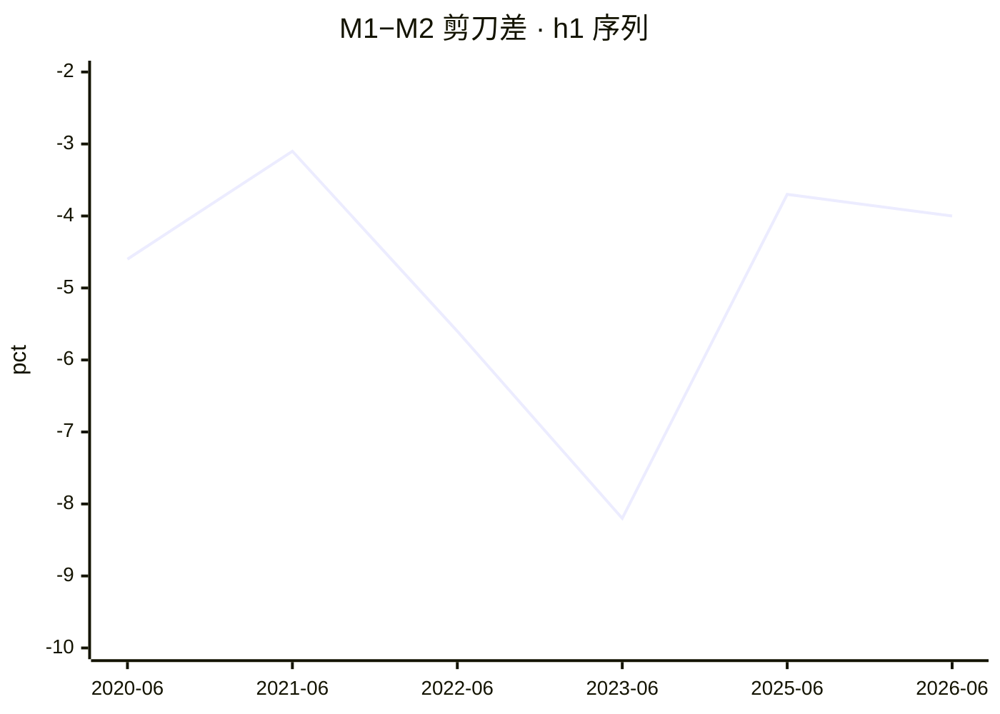
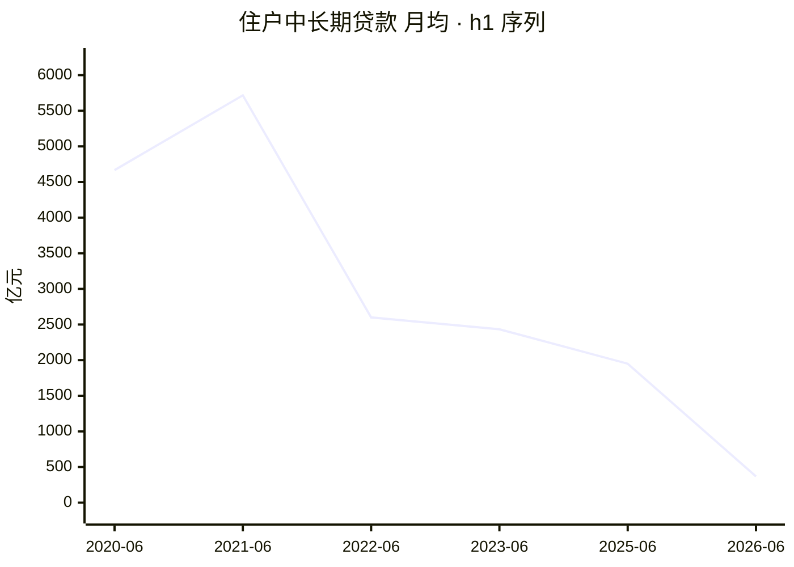
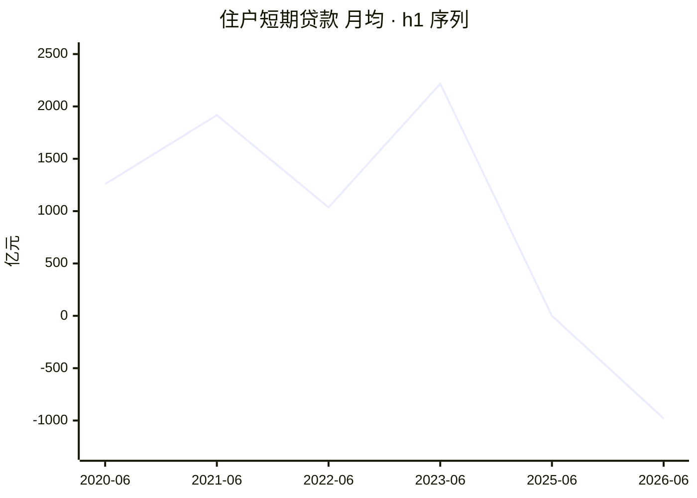

# 2026 年上半年金融统计数据解读

<!-- machine-generated: begin -->
## 本期数据

| 指标 | 单位 | 本期 2026-06（口径 2025-01） | 上期 2025-06 | 去年同期 2025-06 |
| --- | --- | ---: | ---: | ---: |
| 社融存量同比 | 百分数 | 7.40 | — | — |
| M2 同比 | 百分数 | 8 | 8.30 | 8.30 |
| M1 同比 | 百分数 | 4 | 4.60 | 4.60 |
| 住户中长期贷款（ytd） | 亿元 | 2212 | 11700 | 11700 |
| 住户短期贷款（ytd） | 亿元 | -5881 | -3 | -3 |
| 企业贷款合计（ytd） | 亿元 | 111300 | 115700 | 115700 |
| 票据融资（ytd） | 亿元 | 8143 | -464 | -464 |

> 注：`h1` 的同类型上一期就是去年同期（`same_type` 是逐年的），故两列相同。
> 口径标注：本期 `caliber_version` 为 `2025-01`；标 ⚠️ 的列口径不同，**不可直接做同比**。
> 流量字段的 `_ytd`（年初累计）与 `_mom`（当月）不可混比，列名括号里标了取的哪一种。

<!-- check: 3b43497fb821b8246318ff8b2896badd67dc2136faa90cbf66d8e48e145096b2 -->
## 前 12 期

| 期次 | 口径 | M1 同比 | M2 同比 | 住户中长期贷款 | 住户短期贷款 |
| --- | --- | ---: | ---: | ---: | ---: |
| 2025-06 | 2025-01 | 4.60 | 8.30 | 11700 | -3 |
| 2023-06 | 2023-01 | 3.10 | 11.30 | 14600 | 13300 |
| 2022-06 | 2015-01 | 5.80 | 11.40 | 15600 | 6209 |
| 2021-06 | 2015-01 | 5.50 | 8.60 | 34300 | 11500 |
| 2020-06 | 2015-01 | 6.50 | 11.10 | 28000 | 7552 |

> 共 5 期，取自侧车的 `same_type`（同类型前 12 期，有多少列多少）。

<!-- check: f9f84fbfe51692ac41adff9777f89b47acc105e3c80c2f0b6448caa003128819 -->
## 信号

活化 🔴 · 楼市 🔴 · 消费 🔴 · 信贷 🟢 · 温度 1/4

**达成度**：绿灯即 100%；红灯也按距绿灯的远近给值，不一律记 0。

```
活化  剪刀差                 -4 pct   ░░░░░░░░░░    0%  沉淀线 -2 / 活化线 0  🔴
楼市  住户中长期月均     368.67 亿元  ██░░░░░░░░   18%  暖身线 2000  🔴
消费  住户短期月均      -980.17 亿元  ░░░░░░░░░░    0%  暖身线 0  🔴
信贷  票据占企业新增       7.32 %     ██████████  100%  健康线 10 / 严重线 20  🟢
```

## 趋势


> 共 6 期（侧车同类型历史 + 本期）。活化线 0 / 沉淀线 -2。x 轴按侧车实际期次排列，**缺期不补**——轴上没有的期次即未入权威表。


> 共 6 期。暖身线 2000 亿元。月均口径：`_mom` 优先，否则 `_ytd` ÷ 期内月数。


> 共 6 期。暖身线 0 亿元。月均口径：`_mom` 优先，否则 `_ytd` ÷ 期内月数。

## 社融增量结构

```
对实体人民币贷款     107600 亿元  █████░░░░░   51.6%
政府债券              64400 亿元  ███░░░░░░░   30.9%
企业债券              20700 亿元  █░░░░░░░░░    9.9%
股票融资               2933 亿元  ░░░░░░░░░░    1.4%
外币贷款               1609 亿元  ░░░░░░░░░░    0.8%
信托贷款               -446 亿元  ░░░░░░░░░░   -0.2%
委托贷款               -788 亿元  ░░░░░░░░░░   -0.4%
未贴现承兑汇票        -1256 亿元  ░░░░░░░░░░   -0.6%
```

> 分母为社融增量总量 208400 亿元。负值项（净偿还）条留空。

<!-- narrative -->
### （一）经济是在扩张，还是在收缩？

**结论：上半年居民全面去杠杆，资产负债表主动收缩。**

| 指标 | 2026-H1（ytd） | 2025-H1（ytd） | 变化 |
|---|---:|---:|---|
| 住户存款 `deposit_household_ytd` | 75800 亿元 | 107700 亿元 | −29.6% |
| 住户中长期 `loan_hh_mlt_ytd` | 2212 亿元 | 11700 亿元 | −81.1% |
| 住户短期 `loan_hh_short_ytd` | −5881 亿元 | −3 亿元 | 由持平转净偿 |

住户贷款合计从去年净增 11697 亿元转为净减 3669 亿元，存款流入同比萎缩近三成。「少借少花」已从月度趋势固化为上半年整体格局。

### （二）房地产是否真正复苏？

**结论：月均房贷 369 亿元，仅及暖身线 18%。**

月均从去年同期 1950 亿元降至 369 亿元（同口径 `2025-01` 可比），跌幅 81%。净额口径已扣提前还贷，真实新增需求极弱，楼市上半年无实质性复苏。

⚠️ 半年期无 `_mom` 字段，月均以 `loan_hh_mlt_ytd` ÷ 6 计算；单月波动无法识别。

<sub>字段：`loan_hh_mlt_ytd` / `hh_mlt_monthly`</sub>

### （三）消费到底回暖没有？

**结论：消费贷月均 −980 亿元，由持平转大幅净还款。**

去年同期月均几乎持平（−0.5 亿元）；本期 −980 亿元，信贷消费大幅收缩。现金流仍有支撑（`m0_yoy` 11.8%），但居民已从「信贷消费」切换到「动用储蓄消费」，需求来源不可持续。

⚠️ 半年期无 `_mom` 字段，月均以 `loan_hh_short_ytd` ÷ 6 计算；建议交叉核对上半年社零同比。

<sub>字段：`loan_hh_short_ytd` / `hh_short_monthly` / `m0_yoy`</sub>

### （四）企业是在扩张，还是在维持经营？

**结论：中长期占比跌至 50%，扩张意愿显著偏弱。**

| 指标 | 2026-H1（ytd） | 2025-H1（ytd） | 变化 |
|---|---:|---:|---|
| 中长期 `loan_corp_mlt_ytd` | 55500 亿元 | 71700 亿元 | −22.6% |
| 短期 `loan_corp_short_ytd` | 45900 亿元 | 43000 亿元 | +6.7% |
| 合计 `loan_corp_total_ytd` | 111300 亿元 | 115700 亿元 | −3.8% |
| 中长期占比 | 49.9% | 62.0% | −12.1 pct |

中长期/短期比率从 1.67 降至 1.21，企业加速转向流动性补充而非资本性支出。政府债券（64400 vs 76600 亿元）同比收缩 16%，政策拉动上半年明显弱化。

⚠️ 中长期贷款中政策性成分无法拆分，建议交叉看上半年固定资产投资数据。

<sub>字段：`tsf_flow_govt_bond_ytd`</sub>

### （五）企业贷款增长有没有水分？

**结论：票据占比 7.32%，信贷质量绿灯，方向需关注。**

| 指标 | 2026-H1（ytd） | 2025-H1（ytd） | 变化 |
|---|---:|---:|---|
| 票据融资 `loan_bill_ytd` | 8143 亿元 | −464 亿元 | 由净偿转净增 |
| 企业贷款合计 `loan_corp_total_ytd` | 111300 亿元 | 115700 亿元 | −3.8% |
| 票据占比 `bill_ratio` | 7.32% | — | 绿灯 |

去年同期票据净减 464 亿元（主动压缩冲量），本期转为净增 8143 亿元，占比 7.32% 尚在健康线 10% 以内。方向由负转正，若下半年继续抬升需警惕。

⚠️ 2025-H1 票据净偿还，占比为负，故无法做有意义的同比。

### （六）钱去哪儿了？——存款搬家与资金空转

**结论：非银存款占比升至 26%，搬家幅度大幅扩大。**

| 指标 | 2026-H1（ytd） | 2025-H1（ytd） | 变化 |
|---|---:|---:|---|
| 总存款增量 `deposit_flow_ytd` | 177600 亿元 | 179400 亿元 | −1.0% |
| 非银存款 `deposit_nbfi_ytd` | 46500 亿元 | 25500 亿元 | +82.4% |
| 非银存款占比 | 26.2% | 14.2% | +12 pct |
| 非银贷款 `loan_nbfi_ytd` | −4223 亿元 | 331 亿元 | 由增转偿 |

非银存款占比从 14% 跃升至 26%，同时非银贷款由增转偿，存款搬家特征最为明显的一期。低利率环境（同业拆借 1.41%）叠加实体需求不足，资金留在金融体系自循环。

<sub>字段：`rate_ibo`</sub>

### （七）谁在给经济加杠杆？——部门杠杆的转移

**结论：居民逆转，政府收缩，企业独撑但也在弱化。**

| 部门 | 2026-H1（ytd） | 2025-H1（ytd） | 方向 |
|---|---:|---:|---|
| 住户（`loan_hh_mlt_ytd`+`loan_hh_short_ytd`） | −3669 亿元 | 11697 亿元 | 由增转偿 |
| 企业 `loan_corp_total_ytd` | 111300 亿元 | 115700 亿元 | −3.8% |
| 政府 `tsf_flow_govt_bond_ytd` | 64400 亿元 | 76600 亿元 | −15.9% |

三部门同步收缩：居民逆转幅度最大（15366 亿元转向），政府债券增量缩减 16%，企业贷款也在弱化。上半年无单一部门承接内需缺口，总需求压力向下半年传导。

⚠️ 下半年需观察政府债券是否加速发行，以及企业中长期是否止跌。

### （八）钱贵不贵？——利率与资金面

**结论：利率明显下行，宽松无法弥补需求侧缺口。**

| 利率 | 2026-H1 | 2025-H1 | 变化 |
|---|---:|---:|---|
| 同业拆借 `rate_ibo` | 1.41% | 1.46% | −5 bps |
| 质押式回购 `rate_repo` | 1.43% | 1.50% | −7 bps |

两项利率均下行，质押式回购降幅更大（−7 bps），银行间流动性充裕。贷款余额同比 5.2%，较去年同期 7.1% 大幅下滑，上半年实体融资需求持续弱化，宽货币向宽信用传导明显受阻。

<sub>字段：`loan_balance_yoy`</sub>
<!-- /narrative -->
<!-- seal: 04d94a9845f541d17ae229fc371356961f9945079064494cb1228d7f1f04db80 -->
<!-- machine-generated: end -->

## 我的批注

（手写区，永不被覆盖。本样例里这一段替换成了样例说明，真实笔记里是人自己写的意见。）

---

### 这份文件是什么

2026-09-18 的**真实产物**，逐字节取自 vault，只改了上面这个批注区。
留在这里给容器里的模型当**叙述段的参照**：这就是 Step 4 应该写成的样子。

> ⚠️ **同一天换过两次，两次的理由不同，都值得记：**
>
> **第一次**（早）：原样例是 2026-09-16 的产物，每问一个约 300 字的长段。人类读者反馈
> 「阅读很吃力」⇒ `methodology.md` 新增「排版纪律」。**旧版不是错的，是不可读的**
> ——内容对 ≠ 能读。
>
> **第二次**（晚）：第一版把字段名挪到**段末 `<sub>` 行**，可读性上去了，但
> **配对关系丢了**——字段名在一行、数字在另一行，读者和机器都得靠顺序猜。
> 实测自动核对从 27 项降到表内自洽的 3 项。⇒ 改放**表格首列标签**，两头都要。

### 排版长什么样（新纪律的实物）

每一问三段：**加粗结论**（≤30 字）→ **首列带字段名**的对比小表 → ≤150 字论证。

```markdown
| 指标 | 2026-07（ytd） | 2025-07（ytd） | 变化 |
|---|---:|---:|---|
| 住户存款 `deposit_household_ytd` | 69500 亿元 | 96600 亿元 | −28.1% |
```

实测本篇：论证段 **8** 个，最长 **96** 字，**零段超过 150 字**；表格 **17** 行首列带字段名。
对照最初那版：中位 **300** 字、**9/10 段超 150 字**。

🔴 **字段名放首列而不是段末，也不是删掉。** 读的时候它不在句子中间打断节奏；
核的时候「哪个数字对应哪个字段」是显式的。表格已覆盖的字段**不再重复**写段末 `<sub>`。

### 为什么 `reviewed` 仍是 `false`

`reviewed` 是**人审门**，只有人读完并认可才改 `true`。样例里写成 `true`
会让人误以为这是流程能产出的状态——不是，Spool 对每次归档都无条件覆写成 `false`。

### 入库前的核对（2026-09-18）

| 项 | 结果 |
|---|---|
| 表格首列字段 ↔ 数值的配对 | **15 项**逐个比对契约 JSON，**全部一致** |
| 论证段长度 | 8 段，最长 96 字，**零段超 150** |
| `verify.py` | 退出码 **0** |

✅ **配对的机器可核性已恢复**（段末写法那版只能核 3 项）。这是改放首列的主要收益。

### 两处待决

🔴 **一｜「不自己算」这条规则仍在被偏离。** 机器区提示写着「引用上面表里的数字，
不自己算」，而表格的「变化」列是模型算的（本篇实测算得全对）。⇒ 要么把这些变化率
移进 `prepare.py` 让机器算，要么把提示改成「可以算，但必须写出算式」。
**在此之前不要把这份样例当作「可以自己算」的许可。**

🔴 **二｜重放不会重写叙述。** 模型在重放时会**复用旧稿**（M3 冒烟已记录该行为，
`verify.py` 刻意不校验叙述段因而不报错）。所以**改排版纪律对已有笔记无效**——
本次三篇是靠一条显式「请按新纪律重写叙述段」的指令才更新的。
⚠️ **别把它改成「重放总是重写」**：复用恰恰保护了人工编辑过的叙述，
默认重写会把人的修改一次抹掉。合理形态是「显式要求才重写」。
