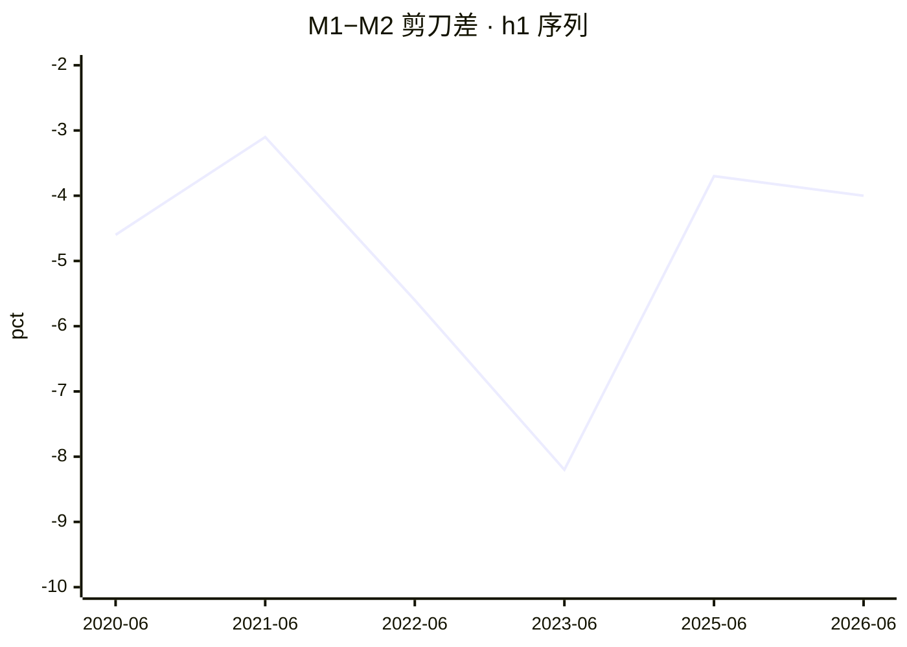
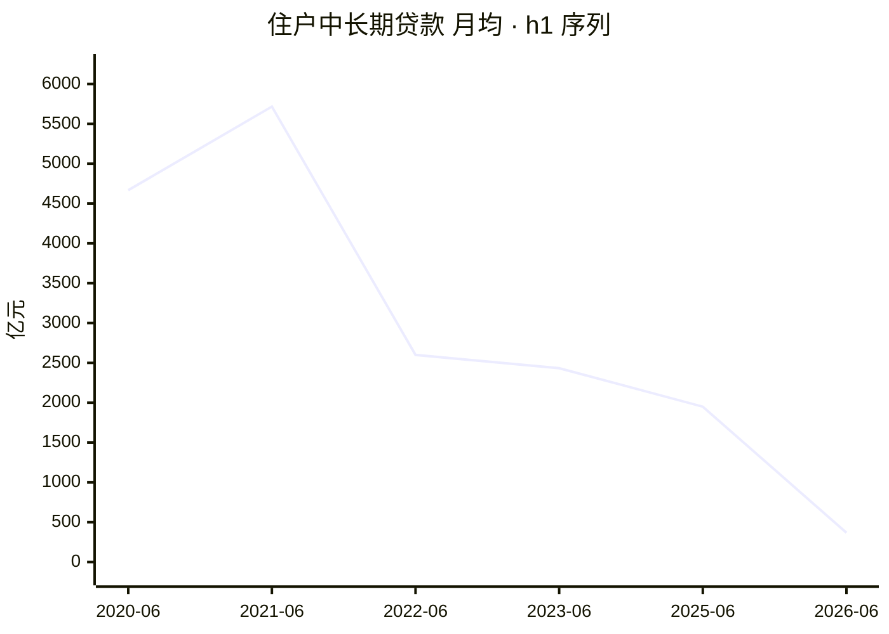
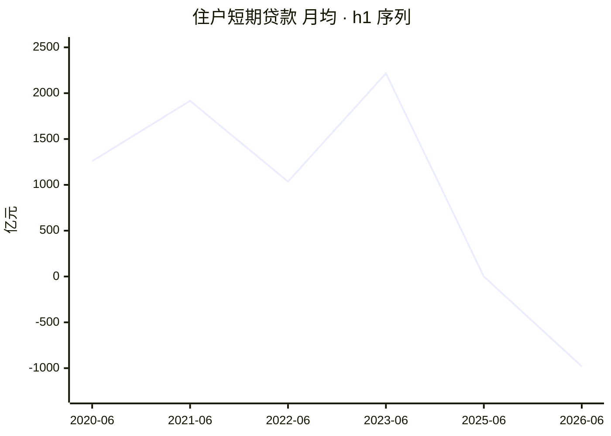

# 2026 年上半年金融统计数据解读

<!-- machine-generated: begin -->
## 本期数据

| 指标 | 单位 | 本期 2026-06（口径 2025-01） | 上期 2025-06 | 去年同期 2025-06 |
| --- | --- | ---: | ---: | ---: |
| 社融存量同比 | 百分数 | 7.40 | — | — |
| M2 同比 | 百分数 | 8 | 8.30 | 8.30 |
| M1 同比 | 百分数 | 4 | 4.60 | 4.60 |
| 住户中长期贷款（ytd） | 亿元 | 2212 | 11700 | 11700 |
| 住户短期贷款（ytd） | 亿元 | -5881 | -3 | -3 |
| 企业贷款合计（ytd） | 亿元 | 111300 | 115700 | 115700 |
| 票据融资（ytd） | 亿元 | 8143 | -464 | -464 |

> 注：`h1` 的同类型上一期就是去年同期（`same_type` 是逐年的），故两列相同。
> 口径标注：本期 `caliber_version` 为 `2025-01`；标 ⚠️ 的列口径不同，**不可直接做同比**。
> 流量字段的 `_ytd`（年初累计）与 `_mom`（当月）不可混比，列名括号里标了取的哪一种。

<!-- check: 3b43497fb821b8246318ff8b2896badd67dc2136faa90cbf66d8e48e145096b2 -->
## 前 12 期

| 期次 | 口径 | M1 同比 | M2 同比 | 住户中长期贷款 | 住户短期贷款 |
| --- | --- | ---: | ---: | ---: | ---: |
| 2025-06 | 2025-01 | 4.60 | 8.30 | 11700 | -3 |
| 2023-06 | 2023-01 | 3.10 | 11.30 | 14600 | 13300 |
| 2022-06 | 2015-01 | 5.80 | 11.40 | 15600 | 6209 |
| 2021-06 | 2015-01 | 5.50 | 8.60 | 34300 | 11500 |
| 2020-06 | 2015-01 | 6.50 | 11.10 | 28000 | 7552 |

> 共 5 期，取自侧车的 `same_type`（同类型前 12 期，有多少列多少）。

<!-- check: f9f84fbfe51692ac41adff9777f89b47acc105e3c80c2f0b6448caa003128819 -->
## 信号

活化 🔴 · 楼市 🔴 · 消费 🔴 · 信贷 🟢 · 温度 1/4

**达成度**：绿灯即 100%；红灯也按距绿灯的远近给值，不一律记 0。

```
活化  剪刀差                 -4 pct   ░░░░░░░░░░    0%  沉淀线 -2 / 活化线 0  🔴
楼市  住户中长期月均     368.67 亿元  ██░░░░░░░░   18%  暖身线 2000  🔴
消费  住户短期月均      -980.17 亿元  ░░░░░░░░░░    0%  暖身线 0  🔴
信贷  票据占企业新增       7.32 %     ██████████  100%  健康线 10 / 严重线 20  🟢
```

## 趋势


> 共 6 期（侧车同类型历史 + 本期）。活化线 0 / 沉淀线 -2。x 轴按侧车实际期次排列，**缺期不补**——轴上没有的期次即未入权威表。


> 共 6 期。暖身线 2000 亿元。月均口径：`_mom` 优先，否则 `_ytd` ÷ 期内月数。


> 共 6 期。暖身线 0 亿元。月均口径：`_mom` 优先，否则 `_ytd` ÷ 期内月数。

## 社融增量结构

```
对实体人民币贷款     107600 亿元  █████░░░░░   51.6%
政府债券              64400 亿元  ███░░░░░░░   30.9%
企业债券              20700 亿元  █░░░░░░░░░    9.9%
股票融资               2933 亿元  ░░░░░░░░░░    1.4%
外币贷款               1609 亿元  ░░░░░░░░░░    0.8%
信托贷款               -446 亿元  ░░░░░░░░░░   -0.2%
委托贷款               -788 亿元  ░░░░░░░░░░   -0.4%
未贴现承兑汇票        -1256 亿元  ░░░░░░░░░░   -0.6%
```

> 分母为社融增量总量 208400 亿元。负值项（净偿还）条留空。

<!-- narrative -->
本期四信号：活化 🔴 / 楼市 🔴 / 消费 🔴 / 信贷 🟢，温度 **1/4**（`temp_score` 1 / `temp_known` 4）。`caliber_version` = `2025-01`；侧车中 2023-06 及更早期次口径不同，以下同比仅引用同口径的 2025-06 H1 数据。

---

### （一）经济是在扩张，还是在收缩？

住户存款 H1 累计净增 `deposit_household_ytd` = 75800 亿元，低于去年同期（2025-06 H1，同口径）的 107700 亿元，增量压缩约 30%。住户贷款方向全面走弱：`loan_hh_mlt_ytd` 2212 亿元 + `loan_hh_short_ytd` -5881 亿元 = 合计净偿还约 3669 亿元；去年同期为净新增约 11697 亿元（11700 + (-3)）。模式从去年的「存↑贷↑」转为「存↓贷↓」——储蓄增量下滑且贷款合计转负，是收入与信心双重走弱的信号，属于四种组合中最差的一档。

### （二）房地产是否真正复苏？

`loan_hh_mlt_ytd` = 2212 亿元，月均 `hh_mlt_monthly` = 368.67 亿元，远低于 `hh_mlt_monthly_warm` = 2000 亿元阈值（约为阈值的 18.4%）。去年同期（2025-06 H1，同口径）月均约 1950 亿元（11700 / 6），今年仅为其 18.9%。该数字为净额——已扣除提前还款——因此数值极低不仅意味着新增按揭少，也含老房贷被大量提前偿还。楼市信号 🔴，与数据完全一致。

### （三）消费到底回暖没有？

`loan_hh_short_ytd` = -5881 亿元，月均 `hh_short_monthly` = -980.17 亿元，明显低于 `hh_short_monthly_warm` = 0 的阈值。去年同期（2025-06 H1，同口径）仅为 -3 亿元，今年 H1 大幅恶化。住户短期贷款大规模净减少，说明居民已从「借钱消费」退回「主动还款」。与此同时 `m0_yoy` = 11.8%，现金持有增速仍高，提示即便有消费发生也主要依赖动用存量现金，而非信贷扩张驱动——前者不可持续。消费信号 🔴。

### （四）企业是在扩张，还是在维持经营？

`loan_corp_mlt_ytd` = 55500 亿元，`loan_corp_short_ytd` = 45900 亿元，中长期 ÷ 短期 = 1.21，低于 `corp_mlt_short_expand` = 1.5 的扩张阈值。去年同期（2025-06 H1，同口径）该比值约为 1.67（71700 / 43000），已转入扩张区间；今年明显回落至维持区间。企业中长期贷款绝对量也从 71700 亿元降至 55500 亿元，收缩幅度约 22.6%。需注意：本期政府债净增 `tsf_flow_govt_bond_ytd` = 64400 亿元，占 H1 社融流量 208400 亿元的 30.9%，政策性配套贷款很可能拉动了企业中长期的一部分，「企业自主扩张」成分需打折扣。

### （五）企业贷款增长有没有水分？

`bill_ratio` = 7.32%（`loan_bill_ytd` 8143 ÷ `loan_corp_total_ytd` 111300 × 100），低于 `bill_ratio_healthy` = 10%，`signal_credit` 🟢。但需关注方向转变：去年同期（2025-06 H1，同口径）`loan_bill_ytd` = -464 亿元（净偿还），今年转为 +8143 亿元（净增），规模变化约 8600 亿元，方向完全逆转。占比虽仍在健康线以内，但票据从净还到净增的变化说明银行在 H1 开始以票据补量。本期所有 `_mom` 字段均在 `absent_fields` 中，无法判断月末/季末集中冲量程度；**建议后续逐月数据可用时再做交叉核查**。

### （六）钱去哪儿了？——存款搬家与资金空转

`deposit_nbfi_ytd` = 46500 亿元，占全部存款净增 `deposit_flow_ytd` 177600 亿元的 26.2%；去年同期（2025-06 H1，同口径）非银存款净增 25500 亿元，占比约 14.2%。非银存款占比从 14.2% 跳升至 26.2%，叠加 `loan_nbfi_ytd` = -4223 亿元（去年同期为 +331 亿元，方向转负），「存款搬家」信号显著——大量资金流向理财、债券基金等渠道。与 `m2_yoy` = 8% 和 `rate_ibo` = 1.41% 对照：货币总量在涨、资金面宽松，但贷款余额同比 `loan_balance_yoy` = 5.2% 明显低于 M2 增速，资金在金融体系内循环而未有效流入实体信贷。

### （七）谁在给经济加杠杆？——部门杠杆的转移

政府是当期最主要的杠杆来源：`tsf_flow_govt_bond_ytd` = 64400 亿元，占 H1 社融流量 208400 亿元的 30.9%；`tsf_stock_govt_bond_yoy` = 14.2%，政府债存量同比仍居高。居民端净偿还约 3669 亿元（`loan_hh_mlt_ytd` + `loan_hh_short_ytd`），企业端虽有 `loan_corp_total_ytd` = 111300 亿元，但中长期占比下滑、扩张信号转弱。政府加杠杆向居民和企业的传导尚未形成有效反馈：居民存款增速放缓、贷款合计净减少，企业中长期贷款下滑——传导断点明显，这是目前最需要持续观察的宏观变量。

### （八）钱贵不贵？——利率与资金面

`rate_ibo` = 1.41%（去年同期 2025-06 H1 为 1.46%，小幅下行），`rate_repo` = 1.43%（去年同期 1.50%，同样下行）。银行间利率处于低位，资金面宽松。与（六）联系：**`rate_ibo` 1.41% 极低而 `loan_balance_yoy` 5.2% 仍弱**，核心矛盾不在资金供给侧（钱不缺、也不贵），而在需求侧——居民和企业借贷意愿持续走弱，继续降息的边际效果面临递减。`signal_activation` 🔴 的根源是 `scissors` = -4（`m1_yoy` 4 − `m2_yoy` 8），与资金持续向定期存款及非银渠道沉淀的图景吻合。

---

**需持续观察**：① 政府杠杆向居民/企业的传导是否出现拐点（看后续月度 `loan_hh_mlt_mom` 与 `loan_corp_mlt_mom`）；② 非银存款占比能否收窄（存款搬家趋势是否见顶）；③ 票据月度数据是否出现季末冲量。
<!-- /narrative -->
<!-- seal: 04d94a9845f541d17ae229fc371356961f9945079064494cb1228d7f1f04db80 -->
<!-- machine-generated: end -->

## 我的批注

（手写区，永不被覆盖。本样例里这一段替换成了样例说明，真实笔记里是人自己写的意见。）

---

### 这份文件是什么

2026-09-16 集成冒烟的**真实产物**，逐字节取自 vault，只改了上面这个批注区。
留在这里给容器里的模型当**叙述段的参照**：这就是 Step 4 应该写成的样子。

### 为什么 `reviewed` 仍是 `false`

`reviewed` 是**人审门**，只有人读完并认可才改 `true`。样例文件里把它写成 `true`
会让人误以为这是流程能产出的状态——不是，Spool 对每一次归档都无条件覆写成 `false`。
这份样例的「人审过」体现在下面的核对记录里，不在这个字段上。

### 入库前的核对（2026-09-16）

| 项 | 结果 |
|---|---|
| 叙述段引用的本期字段 | **16 项**逐个比对契约 JSON，全部一致 |
| 叙述段引用的去年同期字段 | **11 项**逐个比对 history 侧车 `same_type[2025-06]`，全部一致 |
| 叙述段自行计算的比率 | **9 个**（1.21 / 26.2% / 30.9% / 18.4% / 22.6% / 约 30% / 1.67 / 18.9% / 14.2%）重算全部吻合 |
| 口径 | 本期与 2025-06 的 `caliber_version` 同为 `2025-01`，叙述里「仅引用同口径数据」的声明成立 |
| `verify.py` | 退出码 **0** |

### 一处值得学的，和一处别学的

**值得学**：第（五）问点出「本期所有 `_mom` 字段都在 `absent_fields` 里，无法判断季末冲量」，
把**数据的缺口**本身当成结论的一部分写出来，而不是绕开。第（四）问提醒政府债占社融 30.9%，
所以「企业自主扩张」要打折扣——这是在给自己的结论标注可信度。

🔴 **别学**：机器区给模型的提示写着「引用上面表里的数字，**不自己算**」，
而这份叙述算了 9 个比率。**算得全对**，但它是一次规则偏离。
留着不改，是因为改了就不再是那次冒烟的真实产物；下一版要么把这些比率移进 `prepare.py`
让机器算，要么把提示改成「可以算，但必须写出算式」。**在此之前不要把这份样例当作「可以自己算」的许可。**
