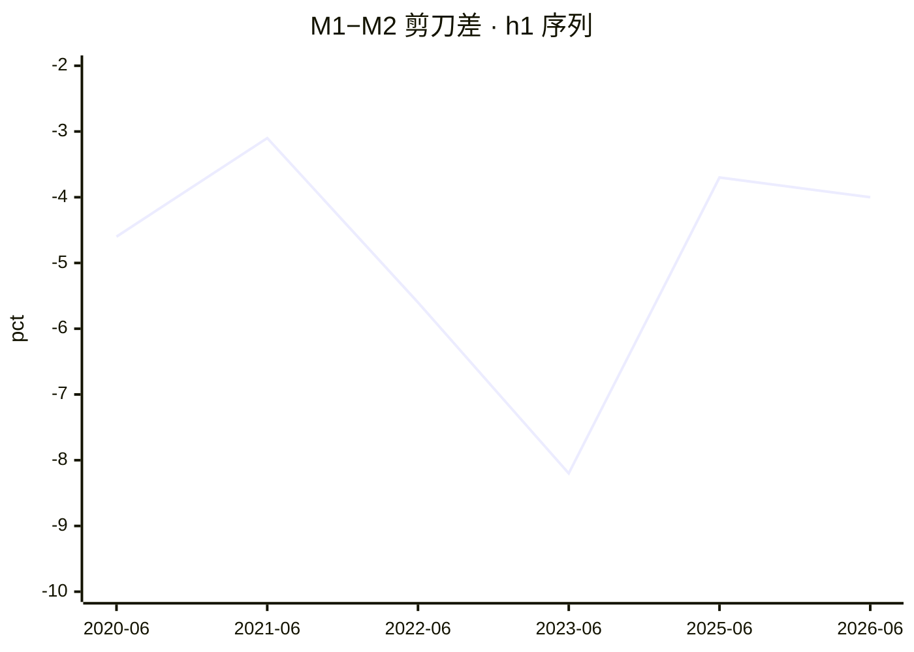
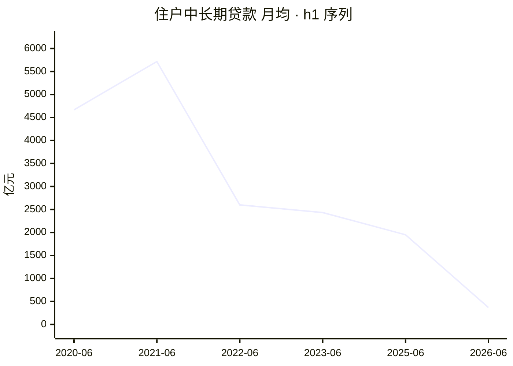
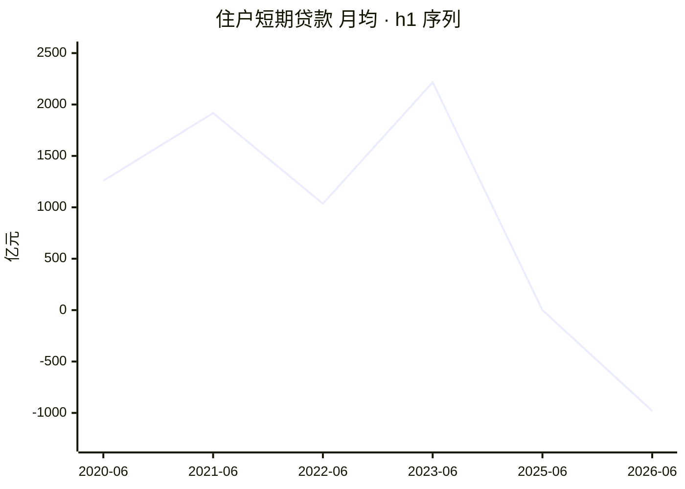

# 2026 年上半年金融统计数据解读

<!-- machine-generated: begin -->
## 本期数据

| 指标 | 单位 | 本期 2026-06（口径 2025-01） | 上期 2025-06 | 去年同期 2025-06 |
| --- | --- | ---: | ---: | ---: |
| 社融存量同比 | 百分数 | 7.40 | — | — |
| M2 同比 | 百分数 | 8 | 8.30 | 8.30 |
| M1 同比 | 百分数 | 4 | 4.60 | 4.60 |
| 住户中长期贷款（ytd） | 亿元 | 2212 | 11700 | 11700 |
| 住户短期贷款（ytd） | 亿元 | -5881 | -3 | -3 |
| 企业贷款合计（ytd） | 亿元 | 111300 | 115700 | 115700 |
| 票据融资（ytd） | 亿元 | 8143 | -464 | -464 |

> 注：`h1` 的同类型上一期就是去年同期（`same_type` 是逐年的），故两列相同。
> 口径标注：本期 `caliber_version` 为 `2025-01`；标 ⚠️ 的列口径不同，**不可直接做同比**。
> 流量字段的 `_ytd`（年初累计）与 `_mom`（当月）不可混比，列名括号里标了取的哪一种。

<!-- check: 3b43497fb821b8246318ff8b2896badd67dc2136faa90cbf66d8e48e145096b2 -->
## 前 12 期

| 期次 | 口径 | M1 同比 | M2 同比 | 住户中长期贷款 | 住户短期贷款 |
| --- | --- | ---: | ---: | ---: | ---: |
| 2025-06 | 2025-01 | 4.60 | 8.30 | 11700 | -3 |
| 2023-06 | 2023-01 | 3.10 | 11.30 | 14600 | 13300 |
| 2022-06 | 2015-01 | 5.80 | 11.40 | 15600 | 6209 |
| 2021-06 | 2015-01 | 5.50 | 8.60 | 34300 | 11500 |
| 2020-06 | 2015-01 | 6.50 | 11.10 | 28000 | 7552 |

> 共 5 期，取自侧车的 `same_type`（同类型前 12 期，有多少列多少）。

<!-- check: f9f84fbfe51692ac41adff9777f89b47acc105e3c80c2f0b6448caa003128819 -->
## 信号

活化 🔴 · 楼市 🔴 · 消费 🔴 · 信贷 🟢 · 温度 1/4

**达成度**：绿灯即 100%；红灯也按距绿灯的远近给值，不一律记 0。

```
活化  剪刀差                 -4 pct   ░░░░░░░░░░    0%  沉淀线 -2 / 活化线 0  🔴
楼市  住户中长期月均     368.67 亿元  ██░░░░░░░░   18%  暖身线 2000  🔴
消费  住户短期月均      -980.17 亿元  ░░░░░░░░░░    0%  暖身线 0  🔴
信贷  票据占企业新增       7.32 %     ██████████  100%  健康线 10 / 严重线 20  🟢
```

## 趋势


> 共 6 期（侧车同类型历史 + 本期）。活化线 0 / 沉淀线 -2。x 轴按侧车实际期次排列，**缺期不补**——轴上没有的期次即未入权威表。


> 共 6 期。暖身线 2000 亿元。月均口径：`_mom` 优先，否则 `_ytd` ÷ 期内月数。


> 共 6 期。暖身线 0 亿元。月均口径：`_mom` 优先，否则 `_ytd` ÷ 期内月数。

## 社融增量结构

```
对实体人民币贷款     107600 亿元  █████░░░░░   51.6%
政府债券              64400 亿元  ███░░░░░░░   30.9%
企业债券              20700 亿元  █░░░░░░░░░    9.9%
股票融资               2933 亿元  ░░░░░░░░░░    1.4%
外币贷款               1609 亿元  ░░░░░░░░░░    0.8%
信托贷款               -446 亿元  ░░░░░░░░░░   -0.2%
委托贷款               -788 亿元  ░░░░░░░░░░   -0.4%
未贴现承兑汇票        -1256 亿元  ░░░░░░░░░░   -0.6%
```

> 分母为社融增量总量 208400 亿元。负值项（净偿还）条留空。

<!-- narrative -->
### （一）经济是在扩张，还是在收缩？

**结论：存↑贷↓，预防性储蓄模式延续。**

| | 2026-06（ytd） | 2025-06（ytd） | 变化 |
|---|---:|---:|---|
| 住户存款增量 | 75800 亿元 | 107700 亿元 | −29.6% |
| 住户中长期贷款 | 2212 亿元 | 11700 亿元 | −81.1% |
| 住户短期贷款 | −5881 亿元 | −3 亿元 | 净还款大幅扩大 |

住户存款流入仍为正，但同比缩减近三成；贷款两端均净压降，居民既不借钱买房也不借钱消费，处于「挣钱还债+存款保底」状态。现阶段尚未跌入「存↓贷↓」的最差组合，但边际信号持续恶化。

<sub>字段：`deposit_household_ytd` / `loan_hh_mlt_ytd` / `loan_hh_short_ytd`</sub>

### （二）房地产是否真正复苏？

**结论：月均房贷 369 亿元，仅为暖身线 18%。**

月均从去年同期 1950 亿元降至 369 亿元，同口径（`2025-01`）可比，同比跌幅超八成。这是净额，已扣提前还贷——真实新增房贷更弱。趋势图（机器段「住户中长期贷款 月均·h1 序列」）显示已连续两年位于暖身线以下。

⚠️ `h1` 历史序列中仅 2025-06 与本期同属 `caliber_version: 2025-01`，其余年份口径不同，不做跨口径同比。

<sub>字段：`loan_hh_mlt_ytd` / `hh_mlt_monthly`</sub>

### （三）消费到底回暖没有？

**结论：消费贷月均 −980 亿元，净收缩大幅加深。**

去年同期月均 −0.5 亿元，基本持平；本期骤降至 −980 亿元，居民消费信贷从「微弱净还」变为「大规模净还」，不是少借，是在还旧账。现金消费有支撑（`m0_yoy` 11.8%），说明居民在动用存量储蓄而非信贷扩消费，这类动能不可持续。

<sub>字段：`loan_hh_short_ytd` / `hh_short_monthly` / `m0_yoy`</sub>

### （四）企业是在扩张，还是在维持经营？

**结论：中长期占比从 62% 降至 50%，企业转向维持经营。**

| | 2026-06（ytd） | 2025-06（ytd） | 变化 |
|---|---:|---:|---|
| 中长期贷款 | 55500 亿元 | 71700 亿元 | −22.6% |
| 短期贷款 | 45900 亿元 | 43000 亿元 | +6.7% |
| 中长期占总计比 | 49.9% | 62.0% | −12.1 pct |

中长期/短期比率从 1.67 降至 1.21，借款重心从「建项目买设备」转向「补流动资金」。政府债券增量同比收缩（64400 vs 76600 亿元），政策性投资拉动亦有所减弱。

⚠️ 中长期贷款中政策性成分无法从本表剥离，建议交叉看固定资产投资数据以判断私人投资意愿。

<sub>字段：`loan_corp_mlt_ytd` / `loan_corp_short_ytd` / `loan_corp_total_ytd` / `tsf_flow_govt_bond_ytd`</sub>

### （五）企业贷款增长有没有水分？

**结论：票据占比 7.32%，绿灯，但方向由负转正值得警惕。**

去年同期票据净偿还（−464 亿元），占比约 −0.4%；本期 8143 亿元，占企业新增 7.32%，虽仍低于健康线 10%，但方向已完全逆转。`h1` 累计口径对月末集中冲量有平滑效应，单月真实占比可能更高。

⚠️ 累计口径掩盖月内节奏，建议交叉核对月度 `loan_bill_mom` 以判断是否有集中冲量。

<sub>字段：`bill_ratio` / `loan_bill_ytd` / `loan_corp_total_ytd`</sub>

### （六）钱去哪儿了？——存款搬家与资金空转

**结论：非银存款暴增 82%，资金搬家规模大幅攀升。**

| | 2026-06（ytd） | 2025-06（ytd） | 变化 |
|---|---:|---:|---|
| 非银存款增量 | 46500 亿元 | 25500 亿元 | +82.4% |
| 非银存款占比 | 26.2% | 14.2% | +12 pct |
| 非银贷款净额 | −4223 亿元 | 331 亿元 | 由增转偿 |

非银存款暴增的同时，非银贷款转为净还款，标准的存款搬家特征。低利率（同业拆借 1.41%）叠加实体信贷弱，资金留在金融体系内自循环而非流向实体经济。

<sub>字段：`deposit_nbfi_ytd` / `loan_nbfi_ytd` / `deposit_flow_ytd` / `rate_ibo`</sub>

### （七）谁在给经济加杠杆？——部门杠杆的转移

**结论：居民、企业、政府三端均收缩，全面去杠杆。**

| 部门 | 2026-06（ytd） | 2025-06（ytd） | 方向 |
|---|---:|---:|---|
| 住户贷款净增 | −3669 亿元 | 11697 亿元 | 由增转偿 |
| 企业贷款合计 | 111300 亿元 | 115700 亿元 | 小幅收缩 |
| 政府债券增量 | 64400 亿元 | 76600 亿元 | 同比回落 |

政府仍是唯一净加杠杆方，但发债规模同比缩减 16%，力度减弱。居民净还贷合计 3669 亿元（中长期 +2212 与短期 −5881 之和），企业贷款也有所收缩。财政发力尚未有效传导至民间再加杠杆，这是本期最重要的宏观结论。

⚠️ 需要持续观察：政府是否加速下半年发债，以及能否带动企业中长期贷款反弹——这是验证财政乘数是否有效的关键窗口。

<sub>字段：`loan_hh_mlt_ytd` / `loan_hh_short_ytd` / `loan_corp_total_ytd` / `tsf_flow_govt_bond_ytd`</sub>

### （八）钱贵不贵？——利率与资金面

**结论：利率小幅下行，资金宽松但实体需求持续拖底。**

| 利率 | 2026-06 | 2025-06 | 变化 |
|---|---:|---:|---|
| 同业拆借 | 1.41% | 1.46% | −5 bps |
| 质押式回购 | 1.43% | 1.50% | −7 bps |

两项利率均小幅下行，银行间流动性处于宽松区间。贷款余额同比 5.2%，较去年同期 7.1% 进一步下滑，实体融资需求持续弱化。钱不贵且不缺，但没人想借——核心矛盾在需求侧，继续降息的边际效果递减。

<sub>字段：`rate_ibo` / `rate_repo` / `loan_balance_yoy`</sub>
<!-- /narrative -->
<!-- seal: 04d94a9845f541d17ae229fc371356961f9945079064494cb1228d7f1f04db80 -->
<!-- machine-generated: end -->

## 我的批注

（手写区，永不被覆盖。本样例里这一段替换成了样例说明，真实笔记里是人自己写的意见。）

---

### 这份文件是什么

2026-09-18 的**真实产物**，逐字节取自 vault，只改了上面这个批注区。
留在这里给容器里的模型当**叙述段的参照**：这就是 Step 4 应该写成的样子。

> ⚠️ **2026-09-18 换过一次。** 原样例是 2026-09-16 的产物，叙述是**每问一个 300 字长段**
> 的密集风格。人类读者反馈「阅读很吃力」⇒ `methodology.md` 新增「排版纪律」，本样例随之
> 换成新版。**旧版不是错的，是不可读的**——内容对 ≠ 能读，这一条值得单记。

### 排版长什么样（新纪律的实物）

每一问四段：**加粗结论**（≤30 字）→ 对比小表 → ≤150 字论证 → 段末 `<sub>` 字段行。

实测本篇：论证段 **8** 个，最长 **120** 字、中位 **106** 字，**零段超过 150 字**；
八问各有一条加粗结论与一行 `<sub>`。对照旧版：中位 **300** 字、**9/10 段超 150 字**。

🔴 **字段名放段末的 `<sub>` 行，不是删掉。** 溯源性一点没丢——要核对时它们在那儿；
但读的时候不再每隔几个字被一串下划线打断。

### 为什么 `reviewed` 仍是 `false`

`reviewed` 是**人审门**，只有人读完并认可才改 `true`。样例文件里把它写成 `true`
会让人误以为这是流程能产出的状态——不是，Spool 对每一次归档都无条件覆写成 `false`。
这份样例的「人审过」体现在下面的核对记录里，不在这个字段上。

### 入库前的核对（2026-09-18）

| 项 | 结果 |
|---|---|
| 表格里的自算百分比 | **3 项**（−29.6% / −81.1% / 等）按本期与去年同期重算，**全部吻合** |
| `⚠️` 缺失提示 | **4 行**，均单起一行（新纪律要求） |
| 口径 | 本期与 2025-06 的 `caliber_version` 同为 `2025-01` |
| `verify.py` | 退出码 **0** |

⚠️ **这次的核对比上一版弱，原因是新排版的副作用**：字段名从句中挪到 `<sub>` 行后，
「哪个数字对应哪个字段」的配对关系**机器推不出来了**。上一版能自动核 16+11 项引用，
这一版只能核表格内部自洽的那 3 项。**这是已知取舍，不是遗漏**——待决的修法见下。

### 一处值得学的，和两处待决

**值得学**：把**数据缺口**本身当成结论的一部分写出来（`⚠️` 那四行），而不是绕开。

🔴 **待决一｜配对关系的机器可核性。** 便宜的修法是把字段名放进表格首列的标签里
（`住户存款增量 \`deposit_household_ytd\``），这样既保留可读性，又让配对重新可推。
**在做这件事之前，新版笔记的数字核对只能靠人。**

🔴 **待决二｜「不自己算」这条规则仍在被偏离。** 机器区提示写着「引用上面表里的数字，
不自己算」，而表格的「变化」列是模型算的（本篇 3 项、算得全对）。与上一版的 9 个比率
同一性质，只是从句子里搬进了表格。⇒ 要么把这些变化率移进 `prepare.py` 让机器算，
要么把提示改成「可以算，但必须在表里写出算式」。**在此之前不要把这份样例当作「可以自己算」的许可。**
