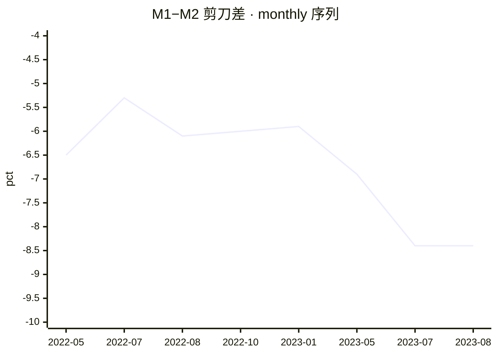
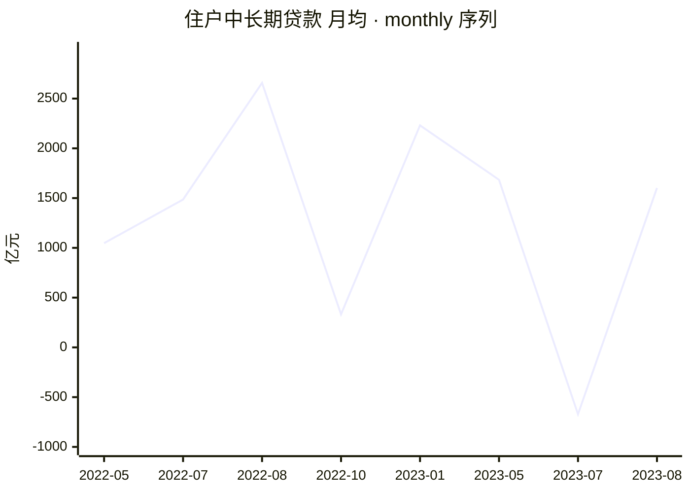
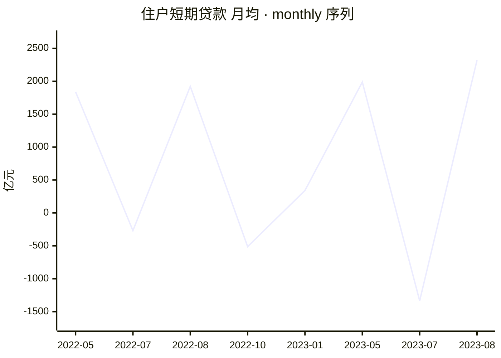

# 2023 年 8 月金融统计数据解读

<!-- machine-generated: begin -->
## 本期数据

| 指标 | 单位 | 本期 2023-08（口径 2023-01） | 上期 2023-07 | 去年同期 2022-08 ⚠️口径 2015-01 |
| --- | --- | ---: | ---: | ---: |
| 社融存量同比 | 百分数 | 9 | 8.90 | 10.50 |
| M2 同比 | 百分数 | 10.60 | 10.70 | 12.20 |
| M1 同比 | 百分数 | 2.20 | 2.30 | 6.10 |
| 住户中长期贷款（mom） | 亿元 | 1602 | -672 | 2658 |
| 住户短期贷款（mom） | 亿元 | 2320 | -1335 | 1922 |
| 企业贷款合计（mom） | 亿元 | 9488 | 2378 | 8750 |
| 票据融资（mom） | 亿元 | 3472 | 3597 | 1591 |

> 口径标注：本期 `caliber_version` 为 `2023-01`；标 ⚠️ 的列口径不同，**不可直接做同比**。
> 流量字段的 `_ytd`（年初累计）与 `_mom`（当月）不可混比，列名括号里标了取的哪一种。

<!-- check: ef41df14ee8f832f954dbccfb1abb6e2db97def922752de8b2a15791c6a1d1e8 -->
## 前 12 期

| 期次 | 口径 | M1 同比 | M2 同比 | 住户中长期贷款 | 住户短期贷款 |
| --- | --- | ---: | ---: | ---: | ---: |
| 2023-07 | 2023-01 | 2.30 | 10.70 | -672 | -1335 |
| 2023-06 | 2023-01 | — | — | — | — |
| 2023-05 | 2023-01 | 4.70 | 11.60 | 1684 | 1988 |
| 2023-03 | 2023-01 | — | — | — | — |
| 2023-01 | 2023-01 | 6.70 | 12.60 | 2231 | 341 |
| 2022-10 | 2015-01 | 5.80 | 11.80 | 332 | -512 |
| 2022-09 | 2015-01 | — | — | — | — |
| 2022-08 | 2015-01 | 6.10 | 12.20 | 2658 | 1922 |
| 2022-07 | 2015-01 | 6.70 | 12 | 1486 | -269 |
| 2022-06 | 2015-01 | — | — | — | — |
| 2022-05 | 2015-01 | 4.60 | 11.10 | 1047 | 1840 |
| 2022-04 | 2015-01 | — | — | — | — |

> 共 12 期，取自侧车的 `same_type`（同类型前 12 期，有多少列多少）。

<!-- check: f4990de661a564aa0f31575ecc239dcd7f1ebf10aac6f41c4a89fbfbc76150ce -->
## 同比变化

| 字段 | 本期 2023-08 | 去年同期 2022-08 | 差额 | 变化 |
| --- | ---: | ---: | ---: | ---: |
| `deposit_balance` | 278.76 | 252.38 | — | —（口径 2015-01≠2023-01） |
| `deposit_balance_yoy` | 10.50 | 11.30 | — | —（口径 2015-01≠2023-01） |
| `deposit_corp_mom` | 8890 | 9551 | — | —（口径 2015-01≠2023-01） |
| `deposit_fiscal_mom` | -88 | -2572 | — | —（口径 2015-01≠2023-01） |
| `deposit_flow_ytd` | 202400 | — | — | —（口径 2015-01≠2023-01） |
| `deposit_household_mom` | 7877 | 8286 | — | —（口径 2015-01≠2023-01） |
| `deposit_nbfi_mom` | -7322 | -4353 | — | —（口径 2015-01≠2023-01） |
| `loan_balance` | 232.28 | 208.28 | — | —（口径 2015-01≠2023-01） |
| `loan_balance_yoy` | 11.10 | 10.90 | — | —（口径 2015-01≠2023-01） |
| `loan_bill_mom` | 3472 | 1591 | — | —（口径 2015-01≠2023-01） |
| `loan_corp_mlt_mom` | 6444 | 7353 | — | —（口径 2015-01≠2023-01） |
| `loan_corp_short_mom` | -401 | -121 | — | —（口径 2015-01≠2023-01） |
| `loan_corp_total_mom` | 9488 | 8750 | — | —（口径 2015-01≠2023-01） |
| `loan_flow_ytd` | 174400 | 156100 | — | —（口径 2015-01≠2023-01） |
| `loan_hh_mlt_mom` | 1602 | 2658 | — | —（口径 2015-01≠2023-01） |
| `loan_hh_short_mom` | 2320 | 1922 | — | —（口径 2015-01≠2023-01） |
| `loan_nbfi_mom` | -358 | -425 | — | —（口径 2015-01≠2023-01） |
| `m0` | 10.65 | 9.72 | — | —（口径 2015-01≠2023-01） |
| `m0_yoy` | 9.50 | 14.30 | — | —（口径 2015-01≠2023-01） |
| `m1` | 67.96 | 66.46 | — | —（口径 2015-01≠2023-01） |
| `m1_yoy` | 2.20 | 6.10 | — | —（口径 2015-01≠2023-01） |
| `m2` | 286.93 | 259.51 | — | —（口径 2015-01≠2023-01） |
| `m2_yoy` | 10.60 | 12.20 | — | —（口径 2015-01≠2023-01） |
| `rate_ibo` | 1.71 | 1.23 | — | —（口径 2015-01≠2023-01） |
| `rate_repo` | 1.76 | 1.24 | — | —（口径 2015-01≠2023-01） |
| `tsf_flow_bankaccept_mom` | 1129 | 3485 | — | —（口径 2015-01≠2023-01） |
| `tsf_flow_corp_bond_mom` | 2698 | 1148 | — | —（口径 2015-01≠2023-01） |
| `tsf_flow_entrust_mom` | 97 | 1755 | — | —（口径 2015-01≠2023-01） |
| `tsf_flow_equity_mom` | 1036 | 1251 | — | —（口径 2015-01≠2023-01） |
| `tsf_flow_fx_loan_mom` | -201 | -826 | — | —（口径 2015-01≠2023-01） |
| `tsf_flow_govt_bond_mom` | 11800 | 3045 | — | —（口径 2015-01≠2023-01） |
| `tsf_flow_mom` | 31200 | 24300 | — | —（口径 2015-01≠2023-01） |
| `tsf_flow_rmb_loan_mom` | 13400 | 13300 | — | —（口径 2015-01≠2023-01） |
| `tsf_flow_trust_mom` | -221 | -472 | — | —（口径 2015-01≠2023-01） |
| `tsf_flow_ytd` | 252100 | 241700 | — | —（口径 2015-01≠2023-01） |
| `tsf_stock` | 368.61 | 337.21 | — | —（口径 2015-01≠2023-01） |
| `tsf_stock_bankaccept` | 2.67 | 2.90 | — | —（口径 2015-01≠2023-01） |
| `tsf_stock_bankaccept_yoy` | -8.20 | -11.50 | — | —（口径 2015-01≠2023-01） |
| `tsf_stock_corp_bond` | 31.46 | 31.54 | — | —（口径 2015-01≠2023-01） |
| `tsf_stock_corp_bond_yoy` | -0.20 | 8 | — | —（口径 2015-01≠2023-01） |
| `tsf_stock_entrust` | 11.33 | 11.06 | — | —（口径 2015-01≠2023-01） |
| `tsf_stock_entrust_yoy` | 2.40 | 1.20 | — | —（口径 2015-01≠2023-01） |
| `tsf_stock_equity` | 11.28 | 10.23 | — | —（口径 2015-01≠2023-01） |
| `tsf_stock_equity_yoy` | 10.20 | 13.90 | — | —（口径 2015-01≠2023-01） |
| `tsf_stock_fx_loan` | 1.82 | 2.19 | — | —（口径 2015-01≠2023-01） |
| `tsf_stock_fx_loan_yoy` | -16.80 | -6.70 | — | —（口径 2015-01≠2023-01） |
| `tsf_stock_govt_bond` | 65.15 | 58.42 | — | —（口径 2015-01≠2023-01） |
| `tsf_stock_govt_bond_yoy` | 11.50 | 17.60 | — | —（口径 2015-01≠2023-01） |
| `tsf_stock_rmb_loan` | 230.24 | 206.83 | — | —（口径 2015-01≠2023-01） |
| `tsf_stock_rmb_loan_yoy` | 10.90 | 10.80 | — | —（口径 2015-01≠2023-01） |
| `tsf_stock_trust` | 3.77 | 3.88 | — | —（口径 2015-01≠2023-01） |
| `tsf_stock_trust_yoy` | -2.90 | -27.40 | — | —（口径 2015-01≠2023-01） |
| `tsf_stock_yoy` | 9 | 10.50 | — | —（口径 2015-01≠2023-01） |

> 🔴 **叙述里的「变化」一律引用本表，不要自己算。** 标 `—` 的用文字描述（如「净还款扩大」），**不要编一个百分比**。
> `_yoy` 与利率字段报的是**百分点差**（`pp`），其余报百分比变化——比率字段算百分比是这类表最常见的错。
> ⚠️ 去年同期口径为 `2015-01`，与本期 `2023-01` 不同 ⇒ **全部字段不可做同比**（见 `references/glossary.md`）。

## 信号

活化 🔴 · 楼市 🔴 · 消费 🟢 · 信贷 🔴 · 温度 1/4

**达成度**：绿灯即 100%；红灯也按距绿灯的远近给值，不一律记 0。

```
活化  剪刀差              -8.40 pct   ░░░░░░░░░░    0%  沉淀线 -2 / 活化线 0  🔴
楼市  住户中长期月均       1602 亿元  ████████░░   80%  暖身线 2000  🔴
消费  住户短期月均         2320 亿元  ██████████  100%  暖身线 0  🟢
信贷  票据占企业新增      36.59 %     ░░░░░░░░░░    0%  健康线 10 / 严重线 20  🔴
```

## 趋势


> 共 8 期（侧车同类型历史 + 本期）。活化线 0 / 沉淀线 -2。x 轴按侧车实际期次排列，**缺期不补**——轴上没有的期次即未入权威表。


> 共 8 期。暖身线 2000 亿元。月均口径：`_mom` 优先，否则 `_ytd` ÷ 期内月数。


> 共 8 期。暖身线 0 亿元。月均口径：`_mom` 优先，否则 `_ytd` ÷ 期内月数。

## 社融增量结构

```
对实体人民币贷款      13400 亿元  ████░░░░░░   42.9%
政府债券              11800 亿元  ████░░░░░░   37.8%
企业债券               2698 亿元  █░░░░░░░░░    8.6%
未贴现承兑汇票         1129 亿元  ░░░░░░░░░░    3.6%
股票融资               1036 亿元  ░░░░░░░░░░    3.3%
委托贷款                 97 亿元  ░░░░░░░░░░    0.3%
外币贷款               -201 亿元  ░░░░░░░░░░   -0.6%
信托贷款               -221 亿元  ░░░░░░░░░░   -0.7%
```

> 分母为社融增量总量 31200 亿元。负值项（净偿还）条留空。

<!-- narrative -->
（判读提示——按 `references/methodology.md` 的**八问**框架写，每一问引用上面表里的数字，不自己算、不改表、不动 frontmatter。）

- **排版**（见 `references/methodology.md` 的「排版纪律」）：每问先写一句**加粗结论**（≤30 字），三值以上的对比进小表（**「变化」列一律引用 `## 同比变化` 段，不自己算；该段标 `—` 的用文字描述、别编百分比**），论证段 ≤150 字，**字段名放表格首列的标签里**（`住户存款 \`deposit_household_ytd\``）、**不要嵌在句子中间**；表格没覆盖的字段才写一行段末 `<sub>`；缺失与警示用 `⚠️` 单起一行。
- 本期四信号：活化 🔴 / 楼市 🔴 / 消费 🟢 / 信贷 🔴，温度 **1/4**。
- 剪刀差 `scissors` = -8.40；`caliber_version` = `2023-01`，**跨口径的期次不要做同比**（见 `references/glossary.md`）。
- 已知信号 4 个 —— **温度的分母是 `temp_known`，不是恒定的 4**；本期四个信号都已知。
- 八问顺序：经济扩张还是收缩 / 房地产是否复苏 / 消费是否回暖 / 企业扩张还是维持 / 贷款有没有水分 / 钱去哪儿了 / 谁在加杠杆 / 钱贵不贵。
<!-- /narrative -->
<!-- seal: 98ba2c2da0ec52fea2c05872c62950377571fb7c92b3e4f42ea000bd110cfca5 -->
<!-- machine-generated: end -->

## 我的批注
（手写区，永不被覆盖）
