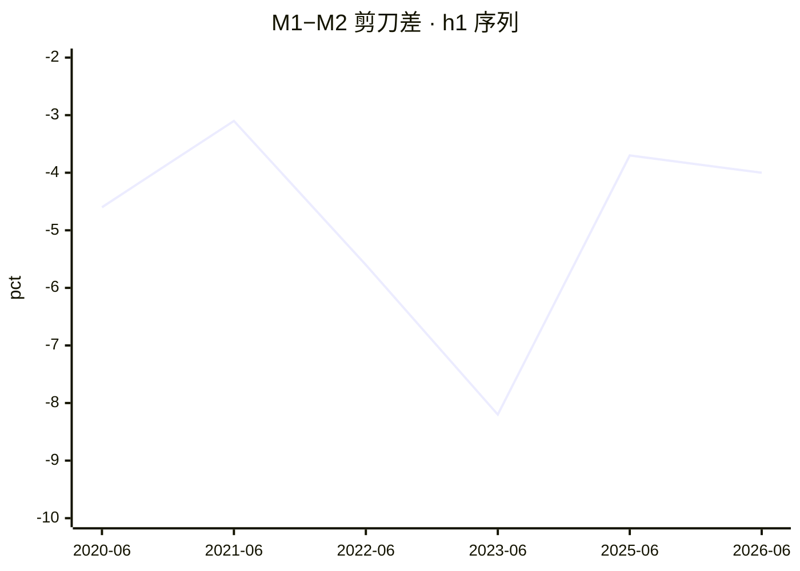
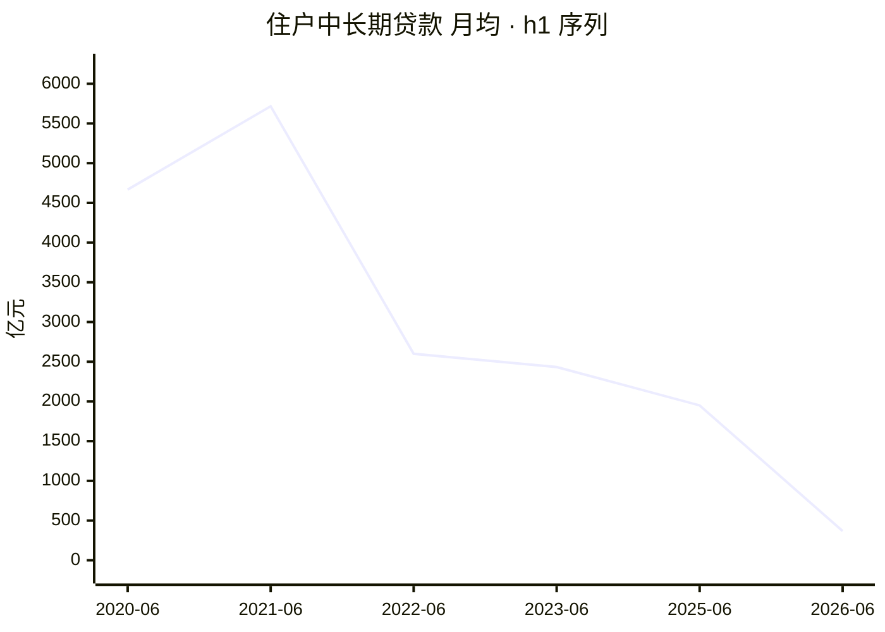
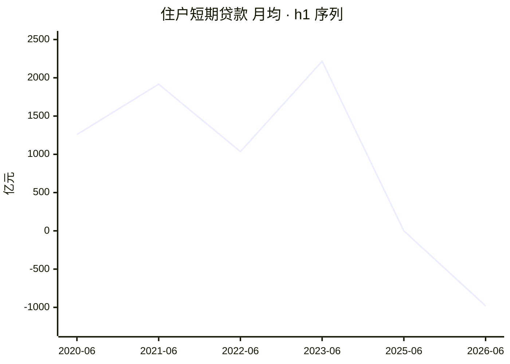

# 2026 年上半年金融统计数据解读

<!-- machine-generated: begin -->
## 本期数据

| 指标 | 单位 | 本期 2026-06（口径 2025-01） | 上期 2025-06 | 去年同期 2025-06 |
| --- | --- | ---: | ---: | ---: |
| 社融存量同比 | 百分数 | 7.40 | — | — |
| M2 同比 | 百分数 | 8 | 8.30 | 8.30 |
| M1 同比 | 百分数 | 4 | 4.60 | 4.60 |
| 住户中长期贷款（ytd） | 亿元 | 2212 | 11700 | 11700 |
| 住户短期贷款（ytd） | 亿元 | -5881 | -3 | -3 |
| 企业贷款合计（ytd） | 亿元 | 111300 | 115700 | 115700 |
| 票据融资（ytd） | 亿元 | 8143 | -464 | -464 |

> 注：`h1` 的同类型上一期就是去年同期（`same_type` 是逐年的），故两列相同。
> 口径标注：本期 `caliber_version` 为 `2025-01`；标 ⚠️ 的列口径不同，**不可直接做同比**。
> 流量字段的 `_ytd`（年初累计）与 `_mom`（当月）不可混比，列名括号里标了取的哪一种。

<!-- check: 3b43497fb821b8246318ff8b2896badd67dc2136faa90cbf66d8e48e145096b2 -->
## 前 12 期

| 期次 | 口径 | M1 同比 | M2 同比 | 住户中长期贷款 | 住户短期贷款 |
| --- | --- | ---: | ---: | ---: | ---: |
| 2025-06 | 2025-01 | 4.60 | 8.30 | 11700 | -3 |
| 2023-06 | 2023-01 | 3.10 | 11.30 | 14600 | 13300 |
| 2022-06 | 2015-01 | 5.80 | 11.40 | 15600 | 6209 |
| 2021-06 | 2015-01 | 5.50 | 8.60 | 34300 | 11500 |
| 2020-06 | 2015-01 | 6.50 | 11.10 | 28000 | 7552 |

> 共 5 期，取自侧车的 `same_type`（同类型前 12 期，有多少列多少）。

<!-- check: f9f84fbfe51692ac41adff9777f89b47acc105e3c80c2f0b6448caa003128819 -->
## 同比变化

| 字段 | 本期 2026-06 | 去年同期 2025-06 | 差额 | 变化 |
| --- | ---: | ---: | ---: | ---: |
| `deposit_balance` | 346.44 | 320.17 | +26.27 | +8.2% |
| `deposit_balance_yoy` | 8.20 | 8.30 | -0.1 | -0.10 pp |
| `deposit_corp_ytd` | 32000 | 17700 | +14300 | +80.8% |
| `deposit_fiscal_ytd` | 9715 | 12500 | -2785 | -22.3% |
| `deposit_flow_ytd` | 177600 | 179400 | -1800 | -1.0% |
| `deposit_household_ytd` | 75800 | 107700 | -31900 | -29.6% |
| `deposit_nbfi_ytd` | 46500 | 25500 | +21000 | +82.4% |
| `fx_rate` | 6.81 | 7.16 | -0.3477 | -4.9% |
| `fx_reserve` | 3.42 | 3.32 | +0.1 | +3.0% |
| `loan_balance` | 282.63 | 268.56 | +14.07 | +5.2% |
| `loan_balance_yoy` | 5.20 | 7.10 | -1.9 | -1.90 pp |
| `loan_bill_ytd` | 8143 | -464 | +8607 | —（符号相反） |
| `loan_corp_mlt_ytd` | 55500 | 71700 | -16200 | -22.6% |
| `loan_corp_short_ytd` | 45900 | 43000 | +2900 | +6.7% |
| `loan_corp_total_ytd` | 111300 | 115700 | -4400 | -3.8% |
| `loan_flow_ytd` | 107200 | 129200 | -22000 | -17.0% |
| `loan_hh_mlt_ytd` | 2212 | 11700 | -9488 | -81.1% |
| `loan_hh_short_ytd` | -5881 | -3 | -5878 | —（基数过小：-3 ⇒ 比率无意义） |
| `loan_nbfi_ytd` | -4223 | 331 | -4554 | —（符号相反） |
| `m0` | 14.74 | 13.18 | +1.56 | +11.8% |
| `m0_yoy` | 11.80 | 12 | -0.2 | -0.20 pp |
| `m1` | 118.48 | 113.95 | +4.53 | +4.0% |
| `m1_yoy` | 4 | 4.60 | -0.6 | -0.60 pp |
| `m2` | 356.71 | 330.29 | +26.42 | +8.0% |
| `m2_yoy` | 8 | 8.30 | -0.3 | -0.30 pp |
| `rate_ibo` | 1.41 | 1.46 | -0.05 | -0.05 pp |
| `rate_repo` | 1.43 | 1.50 | -0.07 | -0.07 pp |
| `tsf_flow_bankaccept_ytd` | -1256 | -557 | -699 | -125.5% |
| `tsf_flow_corp_bond_ytd` | 20700 | 11500 | +9200 | +80.0% |
| `tsf_flow_entrust_ytd` | -788 | -513 | -275 | -53.6% |
| `tsf_flow_equity_ytd` | 2933 | 1707 | +1226 | +71.8% |
| `tsf_flow_fx_loan_ytd` | 1609 | -638 | +2247 | —（符号相反） |
| `tsf_flow_govt_bond_ytd` | 64400 | 76600 | -12200 | -15.9% |
| `tsf_flow_rmb_loan_ytd` | 107600 | 127400 | -19800 | -15.5% |
| `tsf_flow_trust_ytd` | -446 | 1443 | -1889 | —（符号相反） |
| `tsf_flow_ytd` | 208400 | 228300 | -19900 | -8.7% |
| `tsf_stock` | 462.06 | — | — | —（缺值） |
| `tsf_stock_bankaccept` | 2.02 | — | — | —（缺值） |
| `tsf_stock_bankaccept_yoy` | -2.80 | — | — | —（缺值） |
| `tsf_stock_corp_bond` | 36.08 | — | — | —（缺值） |
| `tsf_stock_corp_bond_yoy` | 8.90 | — | — | —（缺值） |
| `tsf_stock_entrust` | 11.24 | — | — | —（缺值） |
| `tsf_stock_entrust_yoy` | 0.50 | — | — | —（缺值） |
| `tsf_stock_equity` | 12.49 | — | — | —（缺值） |
| `tsf_stock_equity_yoy` | 5 | — | — | —（缺值） |
| `tsf_stock_fx_loan` | 1.18 | — | — | —（缺值） |
| `tsf_stock_fx_loan_yoy` | -2.90 | — | — | —（缺值） |
| `tsf_stock_govt_bond` | 101.36 | — | — | —（缺值） |
| `tsf_stock_govt_bond_yoy` | 14.20 | — | — | —（缺值） |
| `tsf_stock_rmb_loan` | 279.16 | — | — | —（缺值） |
| `tsf_stock_rmb_loan_yoy` | 5.30 | — | — | —（缺值） |
| `tsf_stock_trust` | 4.62 | — | — | —（缺值） |
| `tsf_stock_trust_yoy` | 4 | — | — | —（缺值） |
| `tsf_stock_yoy` | 7.40 | — | — | —（缺值） |

> 🔴 **叙述里的「变化」一律引用本表，不要自己算。** 标 `—` 的用文字描述（如「净还款扩大」），**不要编一个百分比**。
> `_yoy` 与利率字段报的是**百分点差**（`pp`），其余报百分比变化——比率字段算百分比是这类表最常见的错。

## 信号

活化 🔴 · 楼市 🔴 · 消费 🔴 · 信贷 🟢 · 温度 1/4

**达成度**：绿灯即 100%；红灯也按距绿灯的远近给值，不一律记 0。

```
活化  剪刀差                 -4 pct   ░░░░░░░░░░    0%  沉淀线 -2 / 活化线 0  🔴
楼市  住户中长期月均     368.67 亿元  ██░░░░░░░░   18%  暖身线 2000  🔴
消费  住户短期月均      -980.17 亿元  ░░░░░░░░░░    0%  暖身线 0  🔴
信贷  票据占企业新增       7.32 %     ██████████  100%  健康线 10 / 严重线 20  🟢
```

## 趋势


> 共 6 期（侧车同类型历史 + 本期）。活化线 0 / 沉淀线 -2。x 轴按侧车实际期次排列，**缺期不补**——轴上没有的期次即未入权威表。


> 共 6 期。暖身线 2000 亿元。月均口径：`_mom` 优先，否则 `_ytd` ÷ 期内月数。


> 共 6 期。暖身线 0 亿元。月均口径：`_mom` 优先，否则 `_ytd` ÷ 期内月数。

## 社融增量结构

```
对实体人民币贷款     107600 亿元  █████░░░░░   51.6%
政府债券              64400 亿元  ███░░░░░░░   30.9%
企业债券              20700 亿元  █░░░░░░░░░    9.9%
股票融资               2933 亿元  ░░░░░░░░░░    1.4%
外币贷款               1609 亿元  ░░░░░░░░░░    0.8%
信托贷款               -446 亿元  ░░░░░░░░░░   -0.2%
委托贷款               -788 亿元  ░░░░░░░░░░   -0.4%
未贴现承兑汇票        -1256 亿元  ░░░░░░░░░░   -0.6%
```

> 分母为社融增量总量 208400 亿元。负值项（净偿还）条留空。

<!-- narrative -->
（判读提示——按 `references/methodology.md` 的**八问**框架写，每一问引用上面表里的数字，不自己算、不改表、不动 frontmatter。）

- **排版**（见 `references/methodology.md` 的「排版纪律」）：每问先写一句**加粗结论**（≤30 字），三值以上的对比进小表（**「变化」列一律引用 `## 同比变化` 段，不自己算；该段标 `—` 的用文字描述、别编百分比**），论证段 ≤150 字，**字段名放表格首列的标签里**（`住户存款 \`deposit_household_ytd\``）、**不要嵌在句子中间**；表格没覆盖的字段才写一行段末 `<sub>`；缺失与警示用 `⚠️` 单起一行。
- 本期四信号：活化 🔴 / 楼市 🔴 / 消费 🔴 / 信贷 🟢，温度 **1/4**。
- 剪刀差 `scissors` = -4；`caliber_version` = `2025-01`，**跨口径的期次不要做同比**（见 `references/glossary.md`）。
- 已知信号 4 个 —— **温度的分母是 `temp_known`，不是恒定的 4**；本期四个信号都已知。
- 八问顺序：经济扩张还是收缩 / 房地产是否复苏 / 消费是否回暖 / 企业扩张还是维持 / 贷款有没有水分 / 钱去哪儿了 / 谁在加杠杆 / 钱贵不贵。
<!-- /narrative -->
<!-- seal: e98f2bd72bbd6d437e329968f6aa65d8e4d25915ff766853bd8080c6a3b6b1ce -->
<!-- machine-generated: end -->

## 我的批注
（手写区，永不被覆盖）
