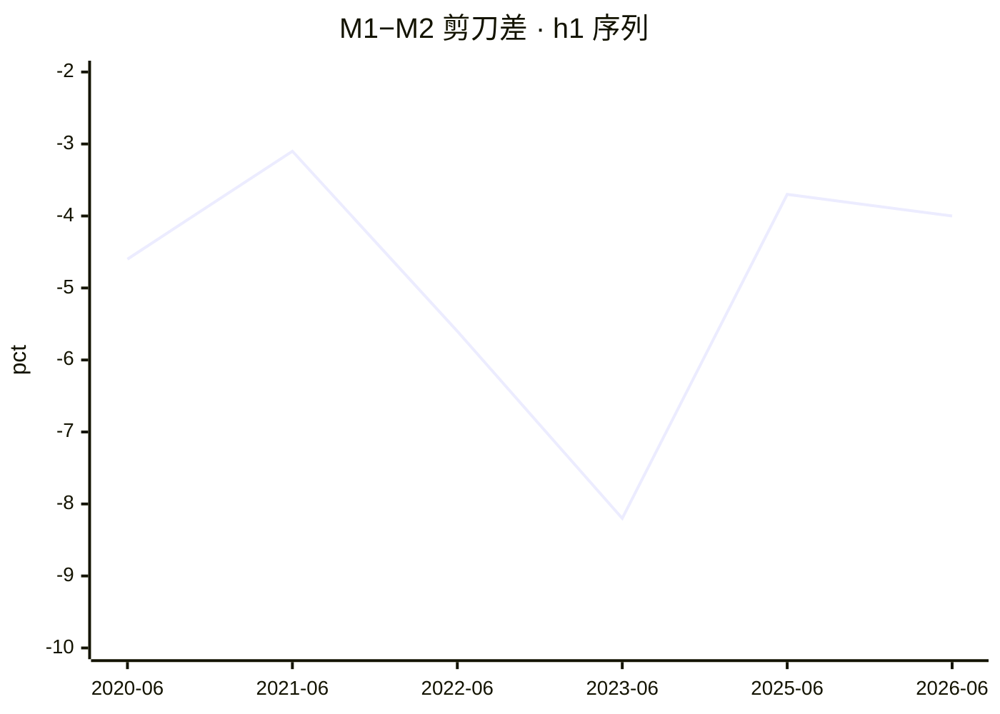
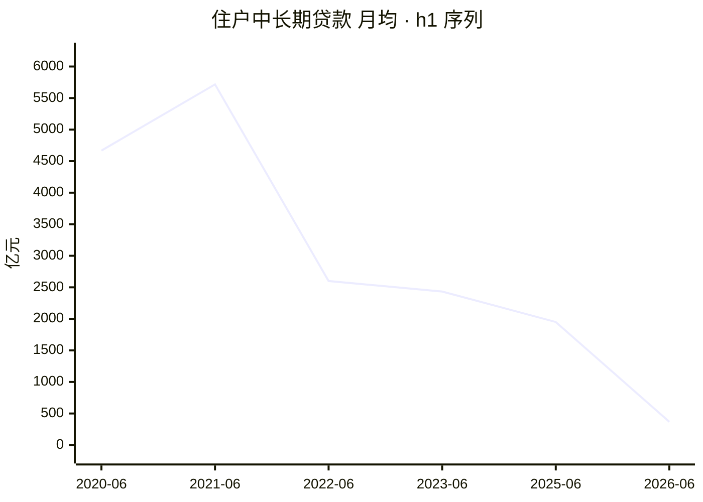
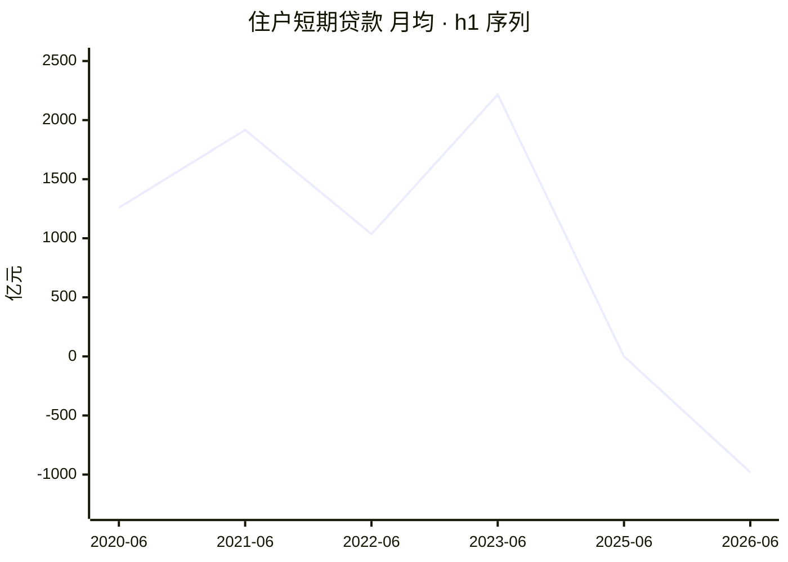

# 2026 年上半年金融统计数据解读

<!-- machine-generated: begin -->
## 本期数据

| 指标 | 单位 | 本期 2026-06（口径 2025-01） | 上期 2025-06 | 去年同期 2025-06 |
| --- | --- | ---: | ---: | ---: |
| 社融存量同比 | 百分数 | 7.40 | — | — |
| M2 同比 | 百分数 | 8 | 8.30 | 8.30 |
| M1 同比 | 百分数 | 4 | 4.60 | 4.60 |
| 住户中长期贷款（ytd） | 亿元 | 2212 | 11700 | 11700 |
| 住户短期贷款（ytd） | 亿元 | -5881 | -3 | -3 |
| 企业贷款合计（ytd） | 亿元 | 111300 | 115700 | 115700 |
| 票据融资（ytd） | 亿元 | 8143 | -464 | -464 |

> 注：`h1` 的同类型上一期就是去年同期（`same_type` 是逐年的），故两列相同。
> 口径标注：本期 `caliber_version` 为 `2025-01`；标 ⚠️ 的列口径不同，**不可直接做同比**。
> 流量字段的 `_ytd`（年初累计）与 `_mom`（当月）不可混比，列名括号里标了取的哪一种。

<!-- check: 3b43497fb821b8246318ff8b2896badd67dc2136faa90cbf66d8e48e145096b2 -->
## 前 12 期

| 期次 | 口径 | M1 同比 | M2 同比 | 住户中长期贷款 | 住户短期贷款 |
| --- | --- | ---: | ---: | ---: | ---: |
| 2025-06 | 2025-01 | 4.60 | 8.30 | 11700 | -3 |
| 2023-06 | 2023-01 | 3.10 | 11.30 | 14600 | 13300 |
| 2022-06 | 2015-01 | 5.80 | 11.40 | 15600 | 6209 |
| 2021-06 | 2015-01 | 5.50 | 8.60 | 34300 | 11500 |
| 2020-06 | 2015-01 | 6.50 | 11.10 | 28000 | 7552 |

> 共 5 期，取自侧车的 `same_type`（同类型前 12 期，有多少列多少）。

<!-- check: f9f84fbfe51692ac41adff9777f89b47acc105e3c80c2f0b6448caa003128819 -->
## 信号

活化 🔴 · 楼市 🔴 · 消费 🔴 · 信贷 🟢 · 温度 1/4

**达成度**：绿灯即 100%；红灯也按距绿灯的远近给值，不一律记 0。

```
活化  剪刀差                 -4 pct   ░░░░░░░░░░    0%  沉淀线 -2 / 活化线 0  🔴
楼市  住户中长期月均     368.67 亿元  ██░░░░░░░░   18%  暖身线 2000  🔴
消费  住户短期月均      -980.17 亿元  ░░░░░░░░░░    0%  暖身线 0  🔴
信贷  票据占企业新增       7.32 %     ██████████  100%  健康线 10 / 严重线 20  🟢
```

## 趋势


> 共 6 期（侧车同类型历史 + 本期）。活化线 0 / 沉淀线 -2。x 轴按侧车实际期次排列，**缺期不补**——轴上没有的期次即未入权威表。


> 共 6 期。暖身线 2000 亿元。月均口径：`_mom` 优先，否则 `_ytd` ÷ 期内月数。


> 共 6 期。暖身线 0 亿元。月均口径：`_mom` 优先，否则 `_ytd` ÷ 期内月数。

## 社融增量结构

```
对实体人民币贷款     107600 亿元  █████░░░░░   51.6%
政府债券              64400 亿元  ███░░░░░░░   30.9%
企业债券              20700 亿元  █░░░░░░░░░    9.9%
股票融资               2933 亿元  ░░░░░░░░░░    1.4%
外币贷款               1609 亿元  ░░░░░░░░░░    0.8%
信托贷款               -446 亿元  ░░░░░░░░░░   -0.2%
委托贷款               -788 亿元  ░░░░░░░░░░   -0.4%
未贴现承兑汇票        -1256 亿元  ░░░░░░░░░░   -0.6%
```

> 分母为社融增量总量 208400 亿元。负值项（净偿还）条留空。

<!-- narrative -->
（判读提示——按 `references/methodology.md` 的**八问**框架写，每一问引用上面表里的数字，不自己算、不改表、不动 frontmatter。）

- 本期四信号：活化 🔴 / 楼市 🔴 / 消费 🔴 / 信贷 🟢，温度 **1/4**。
- 剪刀差 `scissors` = -4；`caliber_version` = `2025-01`，**跨口径的期次不要做同比**（见 `references/glossary.md`）。
- 已知信号 4 个 —— **温度的分母是 `temp_known`，不是恒定的 4**；本期四个信号都已知。
- 八问顺序：经济扩张还是收缩 / 房地产是否复苏 / 消费是否回暖 / 企业扩张还是维持 / 贷款有没有水分 / 钱去哪儿了 / 谁在加杠杆 / 钱贵不贵。
<!-- /narrative -->
<!-- seal: 04d94a9845f541d17ae229fc371356961f9945079064494cb1228d7f1f04db80 -->
<!-- machine-generated: end -->

## 我的批注
（手写区，永不被覆盖）
